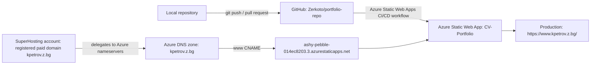
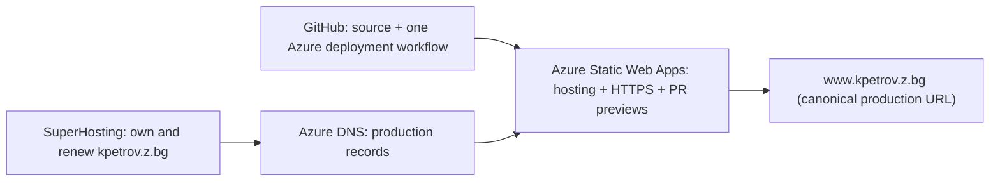

# Hosting And Deployment Map

Last investigated: 2026-05-26 (Europe/Sofia)

## Short Answer

The paid domain and the website host are separate responsibilities:

| Responsibility | Current service | Keep? |
| --- | --- | --- |
| Own and renew `kpetrov.z.bg` | **SuperHosting** | Yes; this is the important paid public identity |
| Answer DNS queries for that domain | **Azure DNS**, delegated from SuperHosting | Yes for now; it is working and aligned with Azure hosting |
| Serve the production site | **Azure Static Web Apps** | Yes; this is the functioning production host |
| Store source and run deployment automation | **GitHub repository and Actions** | Yes |
| Serve a second public copy | **GitHub Pages** | No; this is an outdated, failing duplicate |

SuperHosting is therefore not an additional observed application host. It is the registrar/domain account that keeps `kpetrov.z.bg` active and points the domain's DNS authority to Azure. The production portfolio itself is hosted by Azure Static Web Apps, not GitHub Pages.

## Production Route



The apex URL `https://kpetrov.z.bg/` also returns the same deployed portfolio. Its public DNS is an `A` record rather than the `www` CNAME, and it is very likely registered as an additional Azure Static Web Apps custom domain. Confirm that relationship in the Azure portal as described below.

## Domain Ownership And DNS

Screenshots supplied on 2026-05-26 confirm that `kpetrov.z.bg` is an active domain service in the SuperHosting account, with renewal managed there. The screenshot also shows its DNS setting points to Azure DNS nameservers. This establishes the split:

| Layer | Who controls it | Current role |
| --- | --- | --- |
| Registration and renewal | SuperHosting | Keeps ownership of `kpetrov.z.bg` active |
| Nameserver delegation | SuperHosting setting | Directs DNS lookups to Azure DNS |
| DNS records | Azure DNS zone | Routes apex and `www` to Azure Static Web Apps |
| Website files and HTTPS serving | Azure Static Web Apps | Runs the public portfolio |

No SuperHosting web-hosting plan or hosted website files have been identified. Paying SuperHosting for the domain does not require serving the site from SuperHosting: keeping the valuable domain there while hosting the static app in Azure is a normal architecture.

Do not store account identifiers, payment information, or authentication material from either provider in this repository.

## Azure Resources Identified

The Azure portal screenshots supplied on 2026-05-26 show:

| Resource | Azure type | Purpose |
| --- | --- | --- |
| `CV-Portfolio_Blazor_website` | Resource group | Container for the portfolio resources |
| `CV-Portfolio` | Static Web App | Production website host |
| `kpetrov.z.bg` | DNS zone | Public DNS records for the custom domain |
| `Azure for Students` | Subscription | Subscription containing the resources |

The DNS-zone overview shows Azure DNS nameservers:

```text
ns1-35.azure-dns.com
ns2-35.azure-dns.net
ns3-35.azure-dns.org
ns4-35.azure-dns.info
```

Do not add subscription identifiers, deployment tokens, or other portal credentials to repository documentation.

## Public DNS Evidence

DNS queries made on 2026-05-26 showed:

| Name | Record/result | Meaning |
| --- | --- | --- |
| `www.kpetrov.z.bg` | `CNAME ashy-pebble-014ec8203.3.azurestaticapps.net` | `www` routes directly to the Azure Static Web Apps default hostname |
| `kpetrov.z.bg` | `A 20.82.12.44` | Apex routes to an Azure-served endpoint that returns the same site |
| `kpetrov.z.bg` | Azure DNS `NS` records listed above | Azure DNS is authoritative for this DNS zone |
| `kpetrov.z.bg` | TXT validation record present | Consistent with custom-domain ownership validation |

SuperHosting is the account administering this nameserver delegation. Azure DNS is authoritative only because the SuperHosting domain setting points to the Azure nameservers.

## HTTP Evidence

On 2026-05-26, each of these endpoints returned HTTP `200` with the page title `Portfolio`:

| URL | Observed deployment state |
| --- | --- |
| `https://www.kpetrov.z.bg/` | Current production custom domain |
| `https://kpetrov.z.bg/` | Same current portfolio content as `www` |
| `https://ashy-pebble-014ec8203.3.azurestaticapps.net/` | Same current portfolio content and modification date as the custom domains |

All three reported a `Last-Modified` value of `Tue, 24 Jun 2025 12:17:49 GMT`, aligning with the last successful Azure Static Web Apps deployment observed in GitHub Actions.

## Application Architecture

The application itself is a static-client deployment:

| Part | Implementation |
| --- | --- |
| Runtime | .NET 8 Blazor WebAssembly downloaded and executed in the visitor's browser |
| Entry point | `src/BlazorApp/wwwroot/index.html` starts `_framework/blazor.webassembly.js` |
| Page composition | `Shared/MainLayout.razor` owns stable navigation/footer; `Pages/Index.razor` renders `Home`, `About`, and `Experience` sections |
| Portfolio content | `PortfolioContentService` caches same-origin JSON reads from `wwwroot/sample-data` for the display components |
| Static assets | CSS, images, icons, and generated WebAssembly framework files |
| External browser dependency | Google Fonts imported from `fonts.googleapis.com` |
| Server/API | None identified; no `Api` directory or backend project exists in the repository |

The published app is portable to any provider capable of serving static files over HTTPS. Azure Static Web Apps is the current production provider because it is configured, working, and integrated with the custom domain and deployment flow, not because Blazor requires Azure. The obsolete template `api_location` setting has been removed from the current branch's Azure workflow configuration.

## Deployment From GitHub To Azure

Production workflow file:

```text
.github/workflows/azure-static-web-apps-ashy-pebble-014ec8203.yml
```

Its behavior is:

| Event | Result |
| --- | --- |
| Push to `main` | Builds and deploys the production Azure Static Web App |
| Pull request opened, synchronized, or reopened against `main` | Uploads a pull-request deployment/preview through Azure Static Web Apps |
| Pull request closed against `main` | Closes the Azure pull-request environment |

Important workflow configuration:

| Setting | Value |
| --- | --- |
| GitHub Action | `Azure/static-web-apps-deploy@v1` |
| App source | `/src/BlazorApp` |
| Output | `wwwroot` |
| Deployment credential | GitHub Actions secret named `AZURE_STATIC_WEB_APPS_API_TOKEN_ASHY_PEBBLE_014EC8203` |

GitHub Actions public history showed that the most recent Azure workflow run for `main` succeeded on `2025-06-24T12:15:41Z` for commit `b9ee02a1e811ef7277eb2b6d40ee1a3e45620b03`.

This workflow uses an Azure deployment token stored as a GitHub Actions secret. It does not publish to GitHub Pages. GitHub is running Azure's deployment job; Azure remains the destination hosting platform.

## What The Two Workflows Do

| Workflow | Trigger | Destination | Current result | Needed? |
| --- | --- | --- | --- | --- |
| `azure-static-web-apps-ashy-pebble-014ec8203.yml` | Push to `main`; pull requests targeting `main` | Azure Static Web App `CV-Portfolio` | Successful for current production commit | Yes |
| `publish-gh-pages.yml` | Every pushed branch plus manual runs | GitHub Pages URL | Fails on current pushes; stale earlier site remains visible | No, unless a second mirror is deliberately desired |

The Azure workflow exists because Azure Static Web Apps generated/configured a GitHub Actions integration when the Azure-hosted site was linked to this repository. A workflow file living on GitHub does not mean its destination is GitHub: a workflow can deploy to any external platform when credentials and an action are provided.

## Why GitHub Pages Fails

This repository also contains:

```text
.github/workflows/publish-gh-pages.yml
```

That workflow attempts to deploy a second copy to GitHub Pages at:

```text
https://zerkoto.github.io/portfolio-repo/
```

Findings on 2026-05-26:

- The workflow is still active in GitHub Actions.
- Its current YAML uses `actions/upload-pages-artifact@v2` and `actions/deploy-pages@v1`.
- GitHub's failed job annotation reports that the request was automatically failed because the workflow uses deprecated `actions/upload-artifact@v3` behavior.
- GitHub announced that custom Pages workflows needed to update to `actions/upload-pages-artifact@v3` and `actions/deploy-pages@v4` by 2025-01-30 because v3 artifact actions became unsupported.
- GitHub's current Pages workflow documentation now demonstrates `actions/upload-pages-artifact@v4` and `actions/deploy-pages@v4`; those are the versions to use if a Pages mirror were intentionally restored.
- Its latest observed `main` run failed on 2025-06-24, while the Azure Static Web Apps run for the same commit succeeded.
- The GitHub Pages URL responds, but its content reported an older `Last-Modified` timestamp (`Thu, 30 Jan 2025 01:44:32 GMT`).
- Neither `www.kpetrov.z.bg` nor `kpetrov.z.bg` resolves to GitHub Pages; the production domain resolves through Azure.

This is not a failure of GitHub Pages being unable to host a GitHub repository. It is an obsolete custom workflow: GitHub Pages uses GitHub Actions artifacts for custom builds, and obsolete action versions stop deployments even though the service itself is native to GitHub.

## Why The GitHub Pages URL Is Outdated

GitHub deployment records identify a successful GitHub Pages deployment on `2025-01-30T01:44:37Z`. The live GitHub Pages response reports a matching modification time. Later Pages deployments failed, so GitHub continues serving the last successfully published artifact.

Meanwhile, Azure Static Web Apps successfully deployed newer `main` changes through `2025-06-24T12:15:41Z`. Therefore:

```text
zerkoto.github.io/portfolio-repo/ = last successful GitHub Pages artifact from 2025-01-30
www.kpetrov.z.bg/                 = newer successful Azure Static Web Apps artifact from 2025-06-24
```

Conclusion: GitHub Pages is a legacy secondary deployment path and should not be used for production diagnosis.

## Recommended Target Architecture

Use a single production site and preserve the paid domain as the stable public identity:



Recommended actions, in order:

1. Keep `kpetrov.z.bg` registered and renewed through SuperHosting. This is the public asset to protect.
2. Keep Azure Static Web Apps as the production host because it is already healthy, provides HTTPS for the custom domain, and supports pull-request previews.
3. Keep Azure DNS initially. The current delegation works, and Azure's DNS/domain setup handles the Static Web Apps apex domain cleanly.
4. Remove or disable `.github/workflows/publish-gh-pages.yml`; it has no production purpose and generates failed checks.
5. Disable GitHub Pages in GitHub repository settings after the workflow removal. Deleting only the workflow will stop future attempts but can leave the old public Pages artifact online.
6. Treat `https://www.kpetrov.z.bg/` as the canonical public URL; avoid publishing or linking to the Azure default hostname.

Implementation status on the current documentation/redesign branch:

- `.github/workflows/publish-gh-pages.yml` has been deleted locally and will stop future failed Pages jobs once merged into `main`.
- The remaining Azure workflow has been simplified to remove the nonexistent API path, use explicit least-privilege permissions, and update to `actions/checkout@v6` and `actions/setup-dotnet@v5`, as shown by their current official repositories.
- GitHub Pages must still be disabled through authenticated repository settings after this change is merged, otherwise the stale January 2025 mirror can remain publicly reachable.

## Alternative Consolidation Options

| Option | Benefit | Cost/risk | Recommendation |
| --- | --- | --- | --- |
| Keep SuperHosting registrar + Azure DNS + Azure Static Web Apps | Minimal change; current production path works; retains Azure preview deploys | Two provider consoles for domain/DNS | Recommended now |
| Move DNS records from Azure DNS back to SuperHosting, keep Azure hosting | Potentially fewer Azure resources or lower DNS cost | Must first prove SuperHosting supports suitable apex routing; DNS migration risk | Consider only for measured cost/management reason |
| Move hosting to GitHub Pages and repoint domain DNS | Removes Azure host | Must fix Pages build, migrate custom-domain DNS/HTTPS, loses Azure previews; no present need | Not recommended |
| Move website files to a SuperHosting web-hosting product | One vendor for domain and hosting, if such a paid hosting plan exists | No hosting plan is currently evidenced; requires new deployment mechanism and migration | Not recommended without a separate goal |

For an apex Azure Static Web Apps domain, Microsoft recommends `ALIAS`, `ANAME`, or CNAME flattening where available; an `A` record is supported but can route traffic to a single regional host. Before moving DNS away from Azure, confirm SuperHosting's supported apex record behavior and decide whether the apex should redirect to canonical `www`.

## Framework Maintenance

The app currently targets `.NET 8`, and the local machine used for this investigation has .NET 8 and .NET 9 SDKs installed, but not .NET 10. Microsoft lists .NET 8 patch `8.0.27` as current on 2026-05-26 and `.NET 10` as the longer-lived LTS release, while .NET 8 reaches end of support on 2026-11-10. This branch updates the Blazor packages to `8.0.27`; a migration to `.NET 10` should be scheduled soon and validated with the .NET 10 SDK before it is merged.

## Normal Publishing Process

For code or portfolio-content improvements:

1. Create a feature branch from the current `main`.
2. Make and verify the change locally, normally including `dotnet build .\MyPortfolio.sln`.
3. Push the feature branch to `origin`.
4. Open a pull request into `main`. Azure Static Web Apps should create/update a preview deployment through the pull-request workflow.
5. Review the preview and merge the pull request.
6. Confirm that the Azure Static Web Apps workflow for the merged `main` commit succeeds.
7. Visit `https://www.kpetrov.z.bg/` and verify the intended production change.

Git connectivity from the relocated local repository was checked on 2026-05-26 using a dry-run feature-branch push. It succeeded without publishing a remote branch. Creating pull requests from the command line will require GitHub CLI installation/authentication or use of the GitHub web interface.

## DNS Or Domain Change Process

DNS is managed outside the Git repository. Domain renewal/delegation is managed in SuperHosting; DNS records are currently managed in Azure DNS. For a domain change:

1. In SuperHosting, confirm domain renewal and current nameserver delegation; do not change the delegation during routine content deployments.
2. In Azure portal, open resource group `CV-Portfolio_Blazor_website`.
3. Open Static Web App `CV-Portfolio` and review **Custom domains** before changing any records.
4. Open Azure DNS zone `kpetrov.z.bg` and review **Record sets**.
5. Make the minimal planned change and record the old and new record type/value in `docs/HANDOFF.md`, excluding secrets and account details.
6. Wait for DNS propagation according to the record TTL.
7. Recheck DNS resolution and HTTPS access for both apex and `www` URLs.

## Portal Confirmation Checklist

The following cannot be fully proven from repository files and public DNS alone; confirm them in Azure portal and add the result to `docs/HANDOFF.md`:

- `CV-Portfolio` > **Custom domains** lists `www.kpetrov.z.bg` and `kpetrov.z.bg`, with valid/healthy status.
- `CV-Portfolio` > deployment configuration is linked to GitHub repository `Zerkoto/portfolio-repo` and branch `main`.
- DNS zone **Record sets** contains the `www` CNAME, apex `A` record, and validation TXT record identified publicly.
- If DNS consolidation is considered, SuperHosting's record-management features are checked for Azure Static Web Apps-compatible apex handling before any nameserver change.

## Reference Sources

- GitHub workflow and deployment records: `https://github.com/Zerkoto/portfolio-repo/actions`
- GitHub Pages custom workflow documentation: `https://docs.github.com/en/pages/getting-started-with-github-pages/using-custom-workflows-with-github-pages`
- GitHub Pages artifact-action deprecation notice: `https://github.blog/changelog/2024-12-05-deprecation-notice-github-pages-actions-to-require-artifacts-actions-v4-on-github-com/`
- Azure Static Web Apps custom domain guidance: `https://learn.microsoft.com/en-us/azure/static-web-apps/custom-domain-external`
- Azure Static Web Apps apex domain guidance: `https://learn.microsoft.com/en-us/azure/static-web-apps/apex-domain-external`
